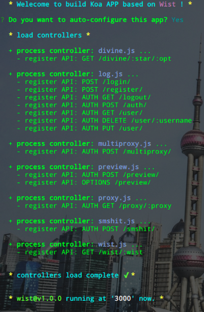

Wist@2
---

Wist is a Koa templete for fast building RESTapi Node.js APP, to use it you should join your own logic code of Middlewares/Controllers/Configs/More.

-- More --

- This repository is incomplete temporarily…
- A complete version expected to be released in Jan 2018 because of UPs work.
